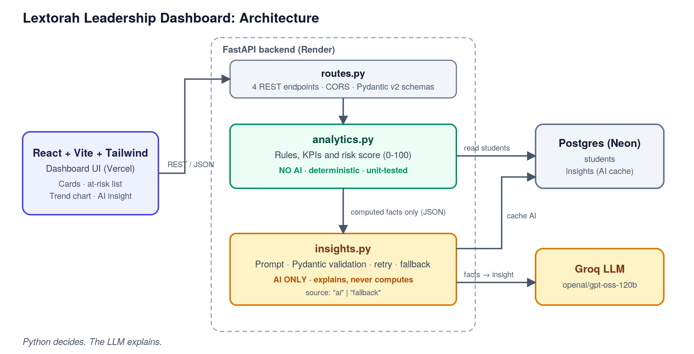

# Lextorah Leadership Dashboard

An AI-powered dashboard that helps a school leader see how a class is doing, spot students who need attention, and get a plain-language explanation with a recommended action.

**Live demo:** https://lextorah-leadership-dashboard.vercel.app

**API:** https://leadership-api-k0yk.onrender.com (`/docs` for the OpenAPI UI)

> The API runs on a free tier and sleeps when idle. The first load can take up to a minute; the UI retries automatically.

## What it does
1. **Class overview:** average score, attendance, declining scores, low attendance, incomplete practice, students at risk.
2. **At-risk list:** students ranked by a 0-100 risk score, highest first. The top student is auto-selected.
3. **Student detail:** metrics, score trend chart and the exact flags that triggered the risk.
4. **AI insight:** *why* it is happening, the *primary concern* and a *recommended action*.

## Architecture


**Core idea: Python decides, the LLM explains.**
- `analytics.py` computes every number and the risk level with transparent rules (score trend 30, attendance 25, practice 25, weakest skill 20). It is deterministic and unit-tested.
- The LLM never sees raw database rows and never does arithmetic. It receives a small JSON of pre-computed facts and returns `why`, `primary_concern` and `recommended_action`.
- The output is validated with **Pydantic v2**, retried once on failure, and replaced by a **rule-based fallback** if Groq is unavailable, so the dashboard never breaks. Responses report `source: "ai" | "fallback"`.
- Only AI output is cached (one row per student); a fallback never blocks a later AI attempt. `?refresh=true` regenerates.

## API
| Method | Endpoint | Purpose |
|---|---|---|
| GET | `/api/class/summary` | Class KPIs |
| GET | `/api/students/at-risk` | Ranked at-risk students with flags |
| GET | `/api/students/{id}` | One student's analysis |
| POST | `/api/students/{id}/insight` | AI insight (cached) |

## Run locally
```bash
# backend (needs Postgres)
cd backend
python -m venv .venv && source .venv/bin/activate   # Windows: .venv\Scripts\activate
pip install -r requirements.txt
cp .env.example .env        # set DATABASE_URL and GROQ_API_KEY
python seed.py              # 30 mock students (drops and recreates tables)
uvicorn app.main:app --reload

# frontend
cd frontend
npm install && cp .env.example .env
npm run dev

# tests
cd backend && pytest
```

## Engineering decisions
- **Simple on purpose:** one service, four endpoints, no auth, no migrations tool. `seed.py` creates the schema for this prototype.
- **Thresholds live in one place** (`analytics.py`), so leaders' definitions of "at risk" can change without touching the AI layer.
- **Deploy:** Vercel (frontend) + Render (API) + Neon (Postgres), configured by `render.yaml`.

